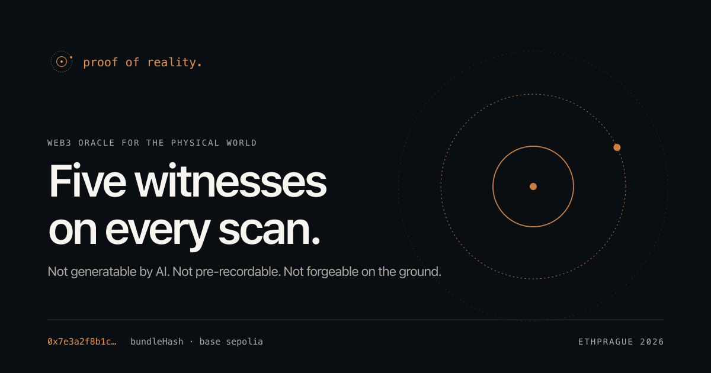
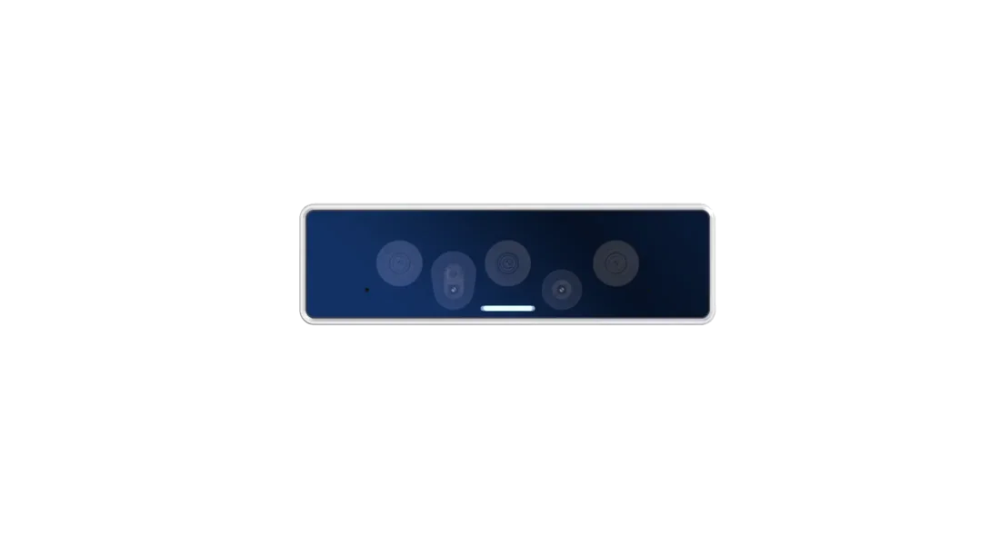

# Proof of Reality

> Web3 oracle for the physical world. Cryptographic proof that an object exists, here, now.
> Not generatable by AI. Not pre-recordable. Not forgeable on the ground.

<p align="center">
  
</p>

A 30-second scan, anchored to a satellite-signed nonce and signed by a key that never leaves hardware, gets minted as a `RealityProof` ERC-721 on Base Sepolia and published as an ENS subname under `realityproof.eth`. Anyone with a browser can re-fetch the bundle from Swarm, recompute the hash, and check all five signatures.

Built at **ETHPrague 2026**.

## Live

| Surface | URL | What it is |
|---|---|---|
| Landing | <https://realityproof.app> | The marketing surface |
| App | <https://app.realityproof.app> | The verifier — every minted Reality NFT, in one wall |
| API | <https://api.realityproof.app> | Backend (cTRNG relay, KMS cosign, Swarm upload, mint) |
| ENS parent | [`realityproof.eth`](https://sepolia.app.ens.domains/realityproof.eth?tab=subnames) | Each mint resolves under here on Eth Sepolia |
| Chain | [Base Sepolia](https://sepolia.basescan.org) | Settlement (chain ID `84532`) |

## The five witnesses

No single party guarantees a proof. Five do, drawn from physics, hardware, and on-chain registries. Each defends a distinct class of attack — to forge a scan you would have to break all five at once.

| # | Witness | Source | Verifies |
|---|---|---|---|
| 1 | **Cosmic nonce** | Orbitport cTRNG · satellite-signed | Capture happened *after* moment T |
| 2 | **KMS co-signature** | SpaceComputer Space Fabric KMS | Bundle hash existed before mint |
| 3 | **Device key** | Apple Secure Enclave (B2C) · USB Armory MkII ECDSA (B2B) | Capture came from real hardware |
| 4 | **Swarm CAC** | Bee BMT chunk root | Bundle is content-addressed, no gateway trust |
| 5 | **App Attest** | Apple (iOS captures only) | App binary is genuine, not a tampered build |

## Architecture

```
                          ┌──────────────────────────────┐
                          │  Orbitport (orbit + edge)    │
                          │   cTRNG · KMS                │
                          └──────────┬───────────────────┘
                                     │ OAuth client_credentials
       ┌─────────────────────────────┴──────────────────────────────┐
       │                                                            │
       ▼                                                            ▼
┌───────────────────────┐                            ┌───────────────────────────┐
│  iOS app (B2C)        │                            │  OAK 4 D + USB Armory MkII│
│                       │                            │  (B2B)                    │
│  Capture (LiDAR)      │                            │  Capture (stereo + RGB)   │
│  Apple Secure Enclave │                            │  Armory ECDSA (DCP+OTPMK) │
└──────────┬────────────┘                            └──────────────┬────────────┘
           │                                                        │
           └─────────────────────┬──────────────────────────────────┘
                                 │  Bearer auth
                                 ▼
                  ┌──────────────────────────────────┐
                  │  Backend (Vercel TS, Express)    │
                  │  thin economic proxy:            │
                  │   • Orbitport client secret      │
                  │   • Swarm postage batch ID       │
                  │   • Minter hot wallet PK         │
                  │  no crypto trust delegated here  │
                  └──────────────┬───────────────────┘
                                 │
                                 ▼
              Base Sepolia: RealityProof.mint(...)
              Swarm: scene + canonical bundle JSON
              ENS Sepolia: subname under realityproof.eth
                                 │
                                 ▼
                   Verifier re-fetches and checks five signatures
```

The backend is a **thin economic proxy**. It holds API quota, postage, and gas — nothing else. If it's fully compromised, attackers can drain those budgets but cannot forge a valid scan: device keys live in hardware, the satellite + KMS keys are public and pinned in clients.

Full version in [`docs/architecture.md`](docs/architecture.md). Trust analysis in [`docs/trust-model.md`](docs/trust-model.md).

## Capture frontends

### B2C — iPhone

LiDAR + Object Capture or RoomPlan. The cosmic nonce is fetched at scan-start and bound into the capture three ways: visible QR in-frame, spoken into the audio track, mixed into sensor timing. The bundle is signed by the Secure Enclave; an App Attest assertion travels with the upload.

See [`apps/ios/`](apps/ios/) and [`docs/b2c-flow.md`](docs/b2c-flow.md).

### B2B — Luxonis OAK 4 D + USB Armory MkII

<p align="center">
  
</p>

Industrial capture station. IP67 aluminum housing, stereo depth + color RGB + 9-axis IMU, on-board NPU. The Armory's hardware-bound ECDSA key signs the bundle hash inside a TamaGo TEE — the private key never leaves the chip and isn't visible to the host OS.

See [`apps/camera-agent/`](apps/camera-agent/) and [`docs/b2b-flow.md`](docs/b2b-flow.md).

## Monorepo

```
proof_of_reality/
├── apps/
│   ├── api/            # Vercel serverless backend (TS, Express, viem)
│   ├── landing/        # Next.js marketing surface — realityproof.app
│   ├── gallery/        # Next.js verifier — app.realityproof.app (the wall of every mint)
│   ├── viewer/         # Next.js per-token verifier (legacy / programmatic)
│   ├── ios/            # B2C Swift app (Xcode project)
│   └── camera-agent/   # B2B Python agent + TamaGo Go firmware for the Armory
├── contracts/          # Hardhat + viem (RealityProof.sol, DeviceRegistry.sol)
├── packages/
│   ├── proof-bundle/         # Canonical schema + zod + keccak. THE source of truth.
│   ├── attestation/          # App Attest + device-key + KMS verifiers
│   ├── contracts-abi/        # ABIs synced from contracts/artifacts
│   ├── verified-swarm-fetch/ # Trustless Swarm gateway client
│   └── tsconfig/             # Shared TS configs
├── infra/
│   ├── swarm/          # Bee node Docker stack + postage stamp purchase
│   └── converter/      # USDZ → GLB conversion service for browser rendering
├── docs/               # Architecture, trust model, flows, pitch
├── PRODUCT.md          # Brand voice + anti-references (read before any UI work)
└── DESIGN.md           # Color tokens, type scale, motion conventions
```

## Quick start

```bash
pnpm install                                  # workspace deps (Node 22+, pnpm 9)
pnpm --filter @proof-of-reality/contracts compile
pnpm abi:sync                                 # populate packages/contracts-abi
pnpm --filter @proof-of-reality/contracts test

# run any dev target:
pnpm dev:api                                  # http://localhost:3000
pnpm dev:landing                              # http://localhost:3001
pnpm --filter @proof-of-reality/gallery dev   # http://localhost:3002
pnpm --filter @proof-of-reality/viewer dev    # http://localhost:3000
```

The B2B camera agent has its own toolchain (uv + Python 3.11):

```bash
pnpm agent:setup     # cd apps/camera-agent && uv sync
pnpm agent:run       # cd apps/camera-agent && uv run proof-agent
```

To smoke-mint a real bundle without an iPhone:

```bash
pnpm --filter @proof-of-reality/api dev     # in one terminal
SCENE_FILE=/path/to/scene.usdz \
  pnpm --filter @proof-of-reality/api exec tsx scripts/smoke-mint.ts
```

Environment setup: [`docs/setup-env.md`](docs/setup-env.md).

## Per-app guides

- [`apps/api/README.md`](apps/api/README.md) — routes, what the backend does and doesn't hold, deploy
- [`apps/landing/README.md`](apps/landing/README.md) — Next.js marketing surface, splat asset pipeline, env vars
- [`apps/ios/README.md`](apps/ios/README.md) — Xcode setup, capture modes, the four-layer iOS proof
- [`apps/camera-agent/README.md`](apps/camera-agent/README.md) — OAK 4 D + Armory wiring, GoTEE applet, recording UI
- [`apps/viewer/README.md`](apps/viewer/README.md) — per-token verifier surface

## Documentation

- [`docs/architecture.md`](docs/architecture.md) — system diagram, two-hash design, canonicalization rules
- [`docs/trust-model.md`](docs/trust-model.md) — what each witness defends, what a backend compromise can and can't do
- [`docs/b2c-flow.md`](docs/b2c-flow.md) — iOS scan → mint walkthrough
- [`docs/b2b-flow.md`](docs/b2b-flow.md) — OAK 4 D + Armory walkthrough
- [`docs/proof-bundle.md`](docs/proof-bundle.md) — bundle schema + canonicalization
- [`docs/setup-env.md`](docs/setup-env.md) — every env var across apps
- [`docs/pitch.md`](docs/pitch.md) — 90-second demo script
- [`PRODUCT.md`](PRODUCT.md) — brand voice and anti-references for any new UI
- [`DESIGN.md`](DESIGN.md) — design tokens and component conventions
- [`DEMO.md`](DEMO.md) — judge-facing walkthrough

## Conventions

- Package manager: **pnpm**. Don't use npm or yarn.
- **Node 22+**. ESM everywhere (`"type": "module"`).
- Workspace deps use `workspace:*`.
- Hex strings: always `0x`-prefixed lower-case. Addresses: viem `Address`. Hashes: `0x` + 64 hex.
- Logger redacts secrets — never log raw assertions, signatures, or private keys.
- The canonicalization in [`packages/proof-bundle/src/canonical.ts`](packages/proof-bundle/src/canonical.ts) is mirrored in [`apps/camera-agent/.../canonical.py`](apps/camera-agent/). **Drift breaks every proof** — change them together and re-run cross-language fixture tests.

## Status

Testnet end-to-end. Contracts deployed on Base Sepolia and verified on Sourcify. ENS subnames published per mint on Ethereum Sepolia under `realityproof.eth`. Scenes and canonical bundles live on a self-hosted Bee node with a 30-day, ~4 GB postage batch (Pinata IPFS as fallback when `STORAGE_BACKEND=ipfs`).

Mainnet is deliberately out of scope: testnet is enough to demonstrate the trust model, and mainnet is operational, not novel.
